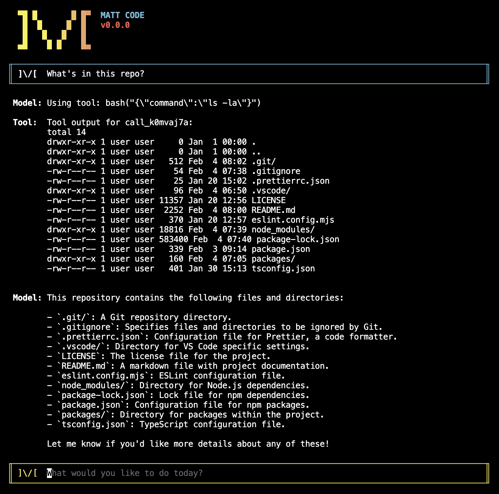

> ⚠️ This project is an early prototype.  All APIs are subject to change.

# Matt Code

An extensible, AI-powered, command-line coding assistant.



## Design

### Plugins
Matt Code is built on [oclif](https://oclif.io/).  This allows it to use oclif's 
[plugin system](https://oclif.io/docs/plugins/) to add functionality to the application.

Matt Code extends the concept of an oclif plugin by allowing them to define providers.  Plugins may implement these providers to add functionality to Matt Code.  

For example, the [ToolProvider](./packages/api/src/tool-provider.ts) allows a plugin to define tools that that AI may call.  One such example can be found in the [just-bash plugin](./packages/plugins/just-bash/) which exposes [Vercel's just-bash](https://github.com/vercel-labs/just-bash) to provide
the Matt Code agent access to the filesystem.

## Requirements

1. [Node](https://nodejs.org/en/download)
1. [Ollama](https://ollama.com/)

## Setup

1. Start the local Ollama server so the CLI can reach it at http://localhost:11434:

   ```bash
   ollama serve
   ```

2. Pull [Qwen3-Coder](https://github.com/QwenLM/Qwen3-Coder):

   ```bash
   ollama pull qwen3-coder:30b
   ```

3. Run the model:

   ```bash
   ollama run qwen3-coder:30b
   ```

## Build

```bash
npm run build
```

## Usage

### Create a client
The OpenAI client is built in to the CLI.  This can be used to connect to Ollama.

> Other clients can be added via plugins.  For example, Gemini support can be added by installing the Google GenAI plugin.
> 
> `packages/cli/bin/run.js plugins link $pwd/packages/plugins/google-genai`

```bash
packages/cli/bin/run.js clients create ollama-openai \
    --type='openai:/v1/chat/completions' \
    --options='{"apiKey": "ollama", "baseURL": "http://localhost:11434/v1"}'
```

### Start TUI session
```bash
packages/cli/bin/run.js 
```

## Acknowlegements

The [Gemini CLI](https://github.com/google-gemini/gemini-cli) has been used as both a reference while writing Matt Code as well as a tool to help write Matt Code.  Many thanks to Google for making this project open source and for providing a free tier.

If you find yourself inspired by the ideas in the project, an attribution to this project would be much appreciated.